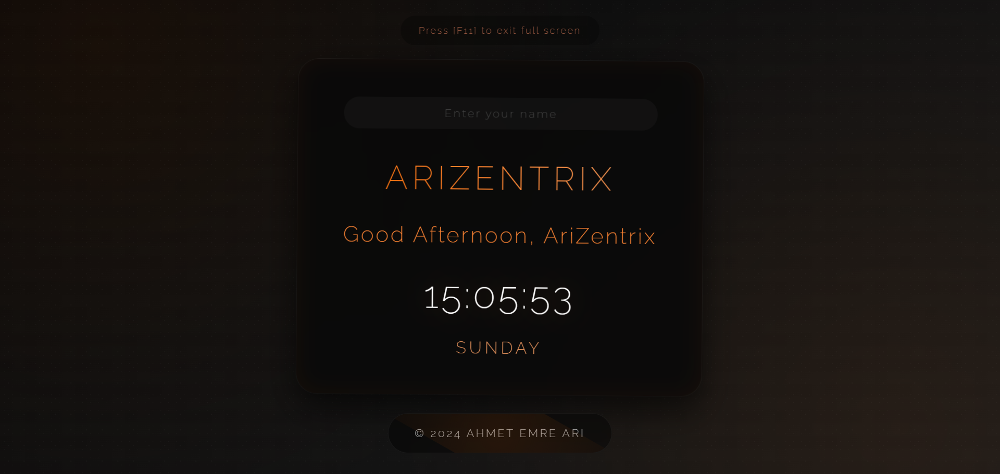

# AriZentrix Welcome Screen



[English](#english) | [Türkçe](#türkçe)

## English

### Features
- Real-time digital clock with date display
- Customizable welcome text with user input
- Elegant animations and 3D effects
- Responsive design for all screen sizes
- Premium glassmorphism UI elements
- Smooth transitions and hover effects

### Technologies Used
- HTML5
- CSS3 (Advanced animations & effects)
- JavaScript (ES6+)
- Google Fonts (Montserrat & Raleway)

### Installation
1. Clone the repository
```bash
git clone https://github.com/yourusername/arizentrix-welcome.git
```

2. Open the project folder
```bash
cd arizentrix-welcome
```

3. Open `index.html` in your web browser or use a local server

### Project Structure
```
arizentrix-welcome/
│
├── index.html
├── style.css
├── clock.js
├── screenshots/
│   └── ss.png
└── README.md
```

### License
This project is licensed under the MIT License - see the LICENSE file for details.

---

## Türkçe

### Özellikler
- Gerçek zamanlı dijital saat ve tarih gösterimi
- Özelleştirilebilir karşılama metni
- Zarif animasyonlar ve 3D efektler
- Tüm ekran boyutları için uyumlu tasarım
- Premium cam görünümlü arayüz elemanları
- Yumuşak geçişler ve hover efektleri

### Kullanılan Teknolojiler
- HTML5
- CSS3 (Gelişmiş animasyonlar ve efektler)
- JavaScript (ES6+)
- Google Fonts (Montserrat & Raleway)

### Kurulum
1. Projeyi klonlayın
```bash
git clone https://github.com/kullaniciadin/arizentrix-welcome.git
```

2. Proje klasörüne gidin
```bash
cd arizentrix-welcome
```

3. `index.html` dosyasını web tarayıcınızda açın veya yerel sunucu kullanın

### Proje Yapısı
```
arizentrix-welcome/
│
├── index.html
├── style.css
├── clock.js
├── screenshots/
│   └── ss.png
└── README.md
```

### Lisans
Bu proje MIT Lisansı ile lisanslanmıştır - detaylar için LICENSE dosyasına bakınız.

---

© 2024 AHMET EMRE ARI